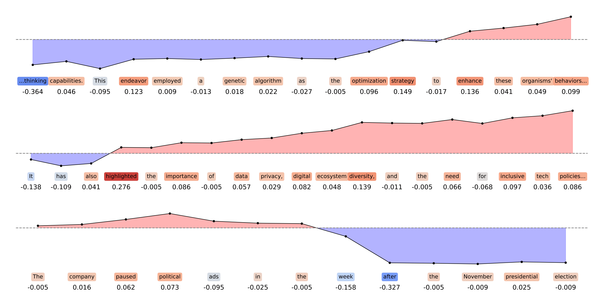

# Human or Not? Light-Weight and Interpretable Detection of AI-Generated Text

This repository contains the implementation of the approach presented in the paper "**Human or Not? Light-Weight and Interpretable Detection of AI-Generated Text**". The project proposes a computationally efficient and interpretable solution for distinguishing human-written from AI-generated text.

## **Overview**

With the increasing realism of AI-generated texts, distinguishing them from human-written content is becoming more important to detect misinformation, plagiarism, and manipulation. This repository contains an implementation of a two-step learning algorithm that transforms texts into **correlation signals**, providing interpretable signals for classification using machine learning models.

The approach involves:

* **Step 1:** Calculating the correlation between words in the document and the associated labels.
* **Step 2:** Mapping the text to a sequence of correlation values, interpreted as a signal.



The method is efficient and interpretable, providing a strong alternative to heavy models like RoBERTa, particularly in scenarios where explainability is essential.

## **Key Features**

* **Lightweight:** Computationally efficient compared to large language models.
* **Interpretable:** Provides both global and local (instance-level) explanations of predictions.
* **Competitive Performance:** Achieves competitive performance on the PAN 2025’s Voight-Kampff Generative AI Detection challenge.
* **Extensible:** Supports both unigram and n-gram extensions to improve feature representation.

## **Setup and Requirements**

We use [uv](https://docs.astral.sh/uv/) as a package manager. After [installing it](https://docs.astral.sh/uv/getting-started/installation/) go into `steely` directory and run

```bash
uv sync
```

This creates a virtual environment `.venv` with the required dependencies. Activate it by calling 
```bash
source .venv/bin/activate
```

### **Data**

* The code uses the datasets from the **Voight-Kampff Generative AI Detection challenge** at PAN 2025.

### **Usage**

1. **Data Preprocessing:** The input texts are tokenized and stemmed using the Porter algorithm, and stop words are removed.
2. **Correlation Signal Computation:** For each word in the text, the Phi-coefficient is computed with respect to the label vector, producing the word's correlation.
3. **Classification:** A simple machine learning classifier, such as **Random Forest**, is used to classify the text based on the average of the correlation signal values.

## **Citation**

If you use this method in your research, please cite the paper:

```
@inproceedings{seeliger2025human,
    title={Human or Not? Light-Weight and Interpretable Detection of AI-Generated Text},
    author={Seeliger, Maximilian and Styll, Patrick and Staudinger, Moritz and Hanbury, Allan},
    booktitle={CLEF Working Notes},
    year={2025},
    address={Madrid, Spain}
}
```
